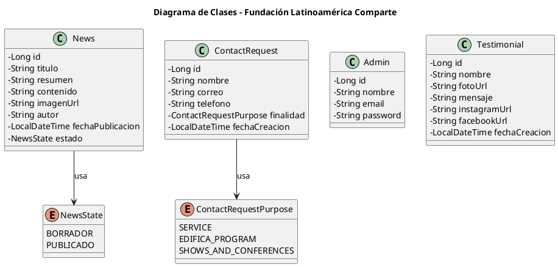

# Ecuador Proyecto - Fundación Latinoamérica Comparte

## URL del repositorio GitHub

Repositorio oficial del proyecto:

https://github.com/fejda/ecuador-proyecto

---

# Descripción del proyecto

Este proyecto corresponde al desarrollo del portal web de Ecuador para la Fundación Latinoamérica Comparte. El sistema permite gestionar noticias, testimonios y solicitudes de contacto de los usuarios interesados en los programas y servicios de la fundación.

La plataforma cuenta con un panel administrativo para la gestión del contenido y una interfaz pública donde los visitantes pueden consultar información y enviar solicitudes de contacto.

El proyecto fue desarrollado utilizando Java, Spring Boot y PostgreSQL bajo una arquitectura por capas.

---

# Funcionalidades principales

## Panel administrativo

- Gestión de noticias
- Gestión de testimonios
- Gestión de solicitudes de contacto
- Administración de contenido del portal

## Usuarios visitantes

- Visualización de noticias
- Visualización de testimonios
- Envío de solicitudes de contacto

---

# Stack de tecnologías

| Tecnología | Versión |
|---|---|
| Java | 17 |
| Spring Boot | 3.x |
| Gradle | 8.x |
| PostgreSQL | 16 |
| Spring Security | Incluido |
| JWT | Incluido |
| Hibernate / JPA | Incluido |
| HTML/CSS/JavaScript | Frontend |
| Bootstrap | UI Responsive |

---

# Requisitos previos

Antes de ejecutar el proyecto debes tener instalado:

- Java JDK 17
- PostgreSQL
- Gradle
- IntelliJ IDEA
- Git

---

# Pasos para correr el proyecto

## 1. Clonar el repositorio

Primero se debe clonar el repositorio del proyecto desde GitHub utilizando el siguiente comando en la terminal:

```bash
git clone https://github.com/fejda/ecuador-proyecto.git
```

Luego se debe ingresar a la carpeta del proyecto.

---

## 2. Instalar y configurar PostgreSQL

Es necesario tener PostgreSQL instalado y en ejecución. Después de instalarlo, se debe crear la base de datos del proyecto con el siguiente comando:

```sql
CREATE DATABASE latinoamerica_comparte;
```

Posteriormente se deben configurar las credenciales de acceso en el archivo `application.properties` ubicado en:

```txt
src/main/resources/application.properties
```

Ejemplo de configuración:

```properties
spring.datasource.url=jdbc:postgresql://localhost:5432/latinoamerica_comparte
spring.datasource.username=postgres
spring.datasource.password=123456

spring.jpa.hibernate.ddl-auto=update
spring.jpa.show-sql=true
```

---

## 3. Abrir el proyecto en IntelliJ IDEA

El proyecto debe abrirse preferiblemente en IntelliJ IDEA debido a su compatibilidad con Gradle y Spring Boot. Una vez abierto, se recomienda esperar a que Gradle descargue automáticamente todas las dependencias necesarias.

---

## 4. Verificar dependencias y versión de Java

Se debe tener instalado Java JDK 17 y Gradle 8 o superior. Además, es importante verificar que el SDK configurado en IntelliJ corresponda a Java 17 para evitar errores de compilación.

---

## 5. Ejecutar el proyecto

El proyecto puede ejecutarse desde IntelliJ iniciando la clase principal de Spring Boot o mediante la terminal con el siguiente comando:

```bash
./gradlew bootRun
```

En Windows PowerShell también puede ejecutarse con:

```powershell
.\gradlew.bat bootRun
```

---

## 6. Acceder al sistema

Una vez iniciado el proyecto correctamente, la aplicación estará disponible en el navegador mediante la siguiente URL:

```txt
http://localhost:8080
```

Desde allí se podrá acceder a las funcionalidades administrativas y de usuario del sistema.

---

# Credenciales de prueba

## Administrador

Correo:

```txt
frank290307@fundacion.com
```

Contraseña:

```txt
290307
```

---

# Estructura de carpetas

```txt
src/
├── main/
│   ├── java/
│   │   └── com/latinoamerica/comparte/
│   │       ├── controller/
│   │       ├── service/
│   │       ├── repository/
│   │       ├── entity/
│   │       ├── dto/
│   │       ├── config/
│   │       ├── security/
│   │       └── EcuadorProyectoApplication.java
│   └── resources/
│       ├── static/
│       ├── templates/
│       └── application.properties
└── test/
```

---

# Diagrama de Clases UML



---

# Modelo Entidad/Relación (Base de Datos)

El sistema está compuesto por cuatro entidades principales independientes entre sí: `Admin`, `News`, `Testimonial` y `ContactRequest`.

No existen relaciones de tipo `@OneToMany` o `@ManyToOne`, ya que cada módulo funciona de manera autónoma dentro del sistema.

---

## Entidad: Admin

| Campo | Tipo | Descripción |
|---|---|---|
| id | Long | Identificador único |
| nombre | String | Nombre del administrador |
| email | String | Correo electrónico |
| password | String | Contraseña del administrador |

---

## Entidad: News

| Campo | Tipo | Descripción |
|---|---|---|
| id | Long | Identificador único |
| titulo | String | Título de la noticia |
| resumen | String | Resumen corto |
| contenido | String | Contenido completo |
| imagenUrl | String | URL de imagen principal |
| autor | String | Autor de la noticia |
| fechaPublicacion | LocalDateTime | Fecha de publicación |
| estado | NewsState | Estado de la noticia |

### Enumeración asociada: NewsState

| Valor |
|---|
| BORRADOR |
| PUBLICADO |

---

## Entidad: Testimonial

| Campo | Tipo | Descripción |
|---|---|---|
| id | Long | Identificador único |
| nombre | String | Nombre de la persona |
| fotoUrl | String | URL de la fotografía |
| mensaje | String | Testimonio |
| instagramUrl | String | URL de Instagram (opcional) |
| facebookUrl | String | URL de Facebook (opcional) |
| fechaCreacion | LocalDateTime | Fecha de creación |

---

## Entidad: ContactRequest

| Campo | Tipo | Descripción |
|---|---|---|
| id | Long | Identificador único |
| nombre | String | Nombre del usuario |
| correo | String | Correo electrónico |
| telefono | String | Número telefónico |
| finalidad | ContactRequestPurpose | Motivo de contacto |
| fechaCreacion | LocalDateTime | Fecha de creación |

### Enumeración asociada: ContactRequestPurpose

| Valor | Descripción |
|---|---|
| SERVICE | Servicio |
| EDIFICA_PROGRAM | Programa Edifica |
| SHOWS_AND_CONFERENCES | Conferencias y shows |

---

# Endpoints REST

## Autenticación

| Método | Endpoint | Descripción |
|---|---|---|
| POST | /api/auth/login | Iniciar sesión |
| POST | /api/auth/logout | Cerrar sesión |

---

## Solicitudes de contacto

| Método | Endpoint | Descripción |
|---|---|---|
| POST | /api/contact-requests | Crear solicitud |
| GET | /api/contact-requests | Listar solicitudes |
| GET | /api/contact-requests/{id} | Ver detalle |
| DELETE | /api/contact-requests/{id} | Eliminar solicitud |

---

## Testimonios

| Método | Endpoint | Descripción |
|---|---|---|
| POST | /api/testimonials | Crear testimonio |
| GET | /api/testimonials | Listar testimonios |
| GET | /api/testimonials/{id} | Ver detalle |
| PUT | /api/testimonials/{id} | Actualizar testimonio |
| DELETE | /api/testimonials/{id} | Eliminar testimonio |

---

## Noticias

| Método | Endpoint | Descripción |
|---|---|---|
| POST | /api/news | Crear noticia |
| GET | /api/news | Listar noticias |
| GET | /api/news/{id} | Ver detalle |
| PUT | /api/news/{id} | Actualizar noticia |
| DELETE | /api/news/{id} | Eliminar noticia |

---

# Arquitectura del proyecto

El proyecto implementa una arquitectura por capas utilizando los siguientes componentes:

- Controller
- Service
- Repository
- Entity
- DTO
- Config
- Security

## Patrones utilizados

- MVC
- DAO / Repository
- DTO
- Inyección de dependencias

---

# Capturas UI/UX

## Login

Agregar captura del login del sistema.

## Dashboard administrativo

Agregar captura del panel principal.

## Gestión de noticias

Agregar captura de administración de noticias.

## Gestión de testimonios

Agregar captura de testimonios.

## Solicitudes de contacto

Agregar captura de solicitudes.

---

# Análisis personal

Durante el desarrollo del proyecto uno de los mayores retos fue la implementación de la arquitectura backend y la integración con PostgreSQL mediante Spring Boot.

También se presentaron dificultades relacionadas con la configuración de Gradle, manejo de dependencias y autenticación utilizando Spring Security y JWT.

Entre los aprendizajes más importantes obtenidos durante el proyecto se encuentran:

- Desarrollo de APIs REST
- Manejo de Spring Boot
- Persistencia de datos con JPA/Hibernate
- Uso de PostgreSQL
- Arquitectura por capas
- Seguridad con JWT
- Trabajo colaborativo con Git y GitHub

Este proyecto permitió fortalecer habilidades prácticas en el desarrollo backend y en la estructuración de aplicaciones empresariales modernas.

---

# Video de sustentación

Link del video:

https://youtube.com/
